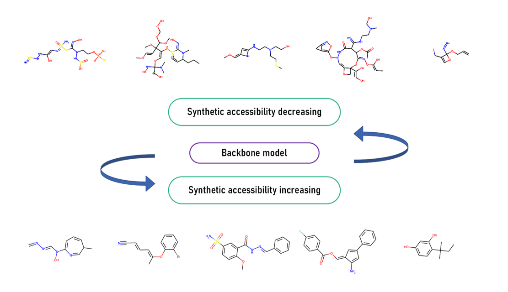

# Magicmol

Implemention of paper : Magicmol - A light-weighted pipeline for drug-like molecule evolution and quick chemical space exploration https://www.researchsquare.com/article/rs-2124702/v1

Magicmol provides a light-weighted pipeline for de novo novel molecule generation and evolution (combine with STONED-SELFIES), and can be utilized for either positive sampling or negative sampling. The process can be visulized in the following picture. 

# Data cleaning and preparation

## Training Data

Original ChEMBL30 (https://www.ebi.ac.uk/chembl/) dataset, cleaned dataset are available at : https://drive.google.com/drive/folders/1ULI0ZxBk26EiCw_p0LnLB1ckgstWK0Hq?usp=sharing

190W: Original Chembl-30 small molecule dataset

database.cleaned.smi / database.smi : pure SMILES data / SMILES data cleaned by clean.py  

database_smiles_0.25.pkl / database_smiles_0.5.pkl : random choosed 25% / 50% of the cleaned molecule data

## Data Cleaning
` python clean.py --in_path database.smi --out_path database_cleaned.smi  --vocab_path ../vocab/chembl_selfies_vocab.yaml `

# Model Weight
The weight file is available at : https://drive.google.com/drive/folders/10LDOoQQzuL0XeDRdsWidhVsoN8W1wxFU?usp=sharing

**Update: Model trained with SMILES is provided also in the above link.**

**Update: SMILES corpus and processing file are available now (see vocab).** 
  

However, we recommend you train the backbone model by yourself and leave it a cup of tea time (approximately 15 min on a single RTX3090) to finish this (XD) and experience how fast the process could be finished.

# But how to run ? 

## Model Training

By default the training process is done by adopting SELFIES, more super parameters can be customized based on your requirements.

` python train.py `

For example, training with SMILES:

` python train.py --num_embeddings 101  --vocab_path ./vocab/chembl_regex_vocab.yaml  --which_vocab regex` 

# SA Optimization

In our work, optimization is done by varying the SA score judged by SYBA from sampled molecules derived from the well-trained backbone model. 

For positive optimization:

` python synthetic_accessibility_modification.py --model_weight_path ../model_parameters/trained_model.pth  --use_syba True  --optim_task  posi`

For negative optimization:

` python synthetic_accessibility_modification.py --model_weight_path ../model_parameters/trained_model.pth  --use_syba True  --optim_task  nega`

# Acknowledgement 

If you think our research is interesting, consider citing this paper? 👇 

Lin Chen, Qing Shen, Jungang Lou et al. Magicmol - A light-weighted pipeline for drug-like molecule evolution and quick chemical space exploration, 10 October 2022, PREPRINT (Version 1) available at Research Square [https://doi.org/10.21203/rs.3.rs-2124702/v1]

STONED-SELFIES is available at: https://github.com/aspuru-guzik-group/stoned-selfies

SYBA is available at https://github.com/lich-uct/syba

